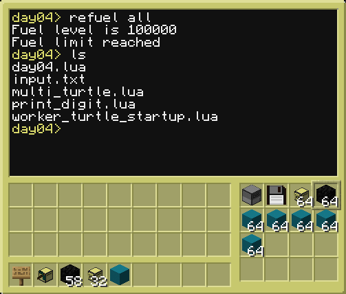

# Setup
Put the main turtle in the bottom right position of the number, and give it the following items: disk drive, floppy disk, stack of turtles, fuel blocks and building blocks. Arrange them in this order.

Run by copying files from this directory (drag&drop) in the day04 directory on the main turtle and execute day04. The main turtle will then spawn worker turtles for each digit in the solution, so that it can print them in parallel.

