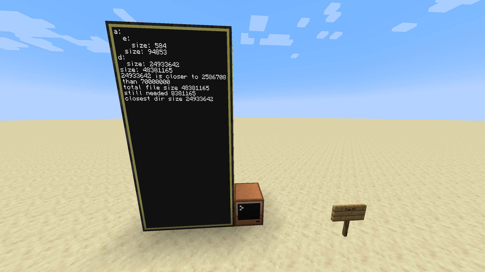

# Setup
Sadly no turtles today, I tried learning a bit about the monitors but got stuck with some regex weirdness in LUA instead 🙁 To run this, put a computer with monitors on the left. Run the program by typing *monitor left day07* after copying the files. It will print the resulting filesystem and the answers on the monitor.

