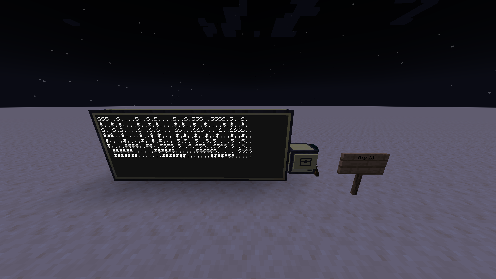

# Setup
To run this, put a turtle with monitors on the left in a 5 wide, 2 heigh configuration. Run the program by typing *day10_part2* after copying the files. It will print the resulting answer on the monitor.

